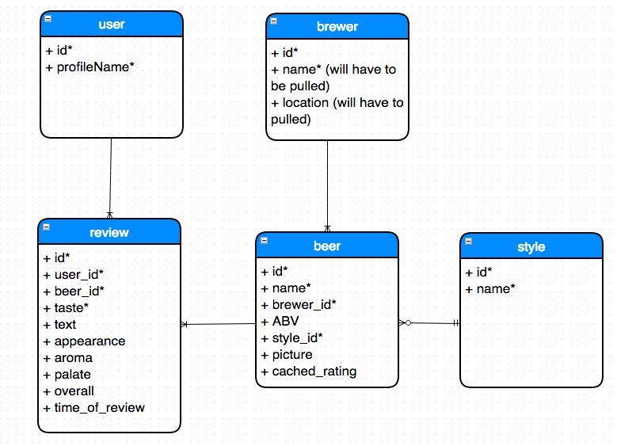

Beer Recommendation Engine

- October 18, 2014
  - added top 3 beer picks method to score module for a user
  - added animated beers to similar users page
  - updated styling
  - added average method for beer ratings through SQL aggregator in Score Module
  - deployed, CSS is different though versus local version and need to figure out why; pagination is off in deployed version too and also need to figure this out
  : need to figure out how to insert current user ratings (for a new user) into the dictionary (which is required because a populate task has not ocurred)
  : look into sidekiq
  : visualizations (spider plots, donut plots) -- like how your beers compare to others, etc.

- October 17, 2014
  - added SQL commands to replace ruby work in Score Module. this sped up recommendation calculator by a ton (went from 19 seconds down to 4 after this)
  - some front end work

- October 16, 2014
  - working on rewriting the Score Module to work with a JSON instead of repeated database queries

- October 15, 2014
  - more styling on beers pages

- October 14, 2014
  - updated beers views to be more appealing, fit pictures

- October 10, 2014
  - product recs

- October 9, 2014
  - adjusted navbar so that a first time user doesn't see top ten option until dictionary has been repopulated with that new user's reviews
  - added pagination
  - looked at SQL commands to replace ruby work for Score Module
    - SQL for average beer rating: ActiveRecord::Base.connection.execute("SELECT beer_id, AVG(taste) FROM reviews GROUP BY beer_id")
    - SQL for pearson corr: ActiveRecord::Base.connection.execute("SELECT corr(u1.taste, u2.taste) from reviews u1 inner join reviews u2 on u2.beer_id = u1.beer_id where u2.user_id = 2 and u1.user_id = 1")
    - SQL for top matches:
  - Cut out most methods from Score module and combined the necessary ones into the recommendations method -- this reduced the recommendation time from 4 hours to 3 minutes
  - Adjusting the minimum correlation to 0.50 reduced the recommendation time from 3 minutes to 19 seconds)
  - I think the dictionary is faster to traverse in ruby than tables in SQL. If that's the case, maybe I should make dictionaries for everything

- October 8, 2014
  - installed foundation, which slowed down views dramatically
  - installed navbar
  - worked on Score module

- October 7, 2014
  - simpearson calculation was resulting in a denominator of 0 for two users with no mutually rated beers. fixed so that method returns 0 if there are no mutually rated beers (as opposed to "NaN" which was getting returned before)
  - top_matches method which returns the top 10 highest pearson similarity scores and user id's
  - added the score related methods to a module Score in models.
  - create migration for pg JSON dictionary data
  - wrote populate.rake file in lib/tasks to populate dictionary db table with most recent rating data (run with rake dictionary:populate)
  - Score module self methods to calculate pearson similarity score and other statistics
  - update users view to show top similar users

- October 6, 2014
  - indexed foreign keys
  - Prior to indexing foreign keys: importing all 4348 beers took 10,786 ms and 414 sql queries (learned through my profiler); after adding foreign keys, this took 10,632 ms and 414 sql queries.
  - worked on similarity algorithms and methods

- October 5, 2014
  - added devise gem for user registration
  - updated seed file for allowing required user inputs from devise
  - added ability for user to add reviews of beers
  - added unit tests for models
  - added feature tests for signing up, singing in and out
  - added feature tests for user to add a review and rating for a beer
  - found out why seeding was failing at review ~86k ("la-saint-pierre-blonde-de-l`oncle-hansi-" was some extra text appended to the brewer id in some of the beers. need to make sure to watch for this in the future (when going for 4mm records))
  - added more links between users and beers and ratings to allow clicking through them

- October 2, 2014
  - main page of 3700 beers took around 5960 ms to load (found this from mini profiler); 375 sql queries
  - looked into eager loading and some other methods to speed up query of all beers
  - add indices to all foreign keys

Current Todos:

- figure out efficiency issue with seed uploader

- create visual diagram of how the recommendation engine works

- add ! to create methods in seeders so if it  fails if create/save doesn't work: "you should try using #create! instead of #create so that you receive an error if the create fails. It's also probably good to use #find_or_create! so that you can run the script multiple times without creating duplicates."

- butttt I think you want to look at this for why your data isn’t all getting in there https://github.com/vikram7/beer-recommender/blob/master/app/models/review.rb#L9-L10 you’re saying that a user can only review one beer as having a particular taste rating. so as a user i couldn’t review two different beers as having a 3 for taste

- also http://guides.rubyonrails.org/active_record_validations.html#presence "If you want to be sure that an association is present, you'll need to test whether the associated object itself is present, and not the foreign key used to map the association."

- you should read this post too https://tomafro.net/2009/08/using-indexes-in-rails-choosing-additional-indexes. you should also use indexes to make sure that column entries really are unique at the database level. and if you’re scoping them, you need to use a compound index. and if you’re scoping them, you need to use a compound index. like add_index :reviews, [:beer_id, :user_id], unqiue: true. i would probably make separate migrations for each of the tables that you’re adding indexes to

- write user stories

- UI for ratings & reviews
  - user stories & wireframes
  - user finds beer and reviews it
  - after x amount of beers, the recommendation engine is unlocked

- capybara and unit tests

- research algorithms
  - cs problems with optimal algorithms (consider what kinds of filters you would use)
  - apply different algorithms to the same problem and see what kinds of algorithms give you the best results (adapter pattern)

- think about ways to present findings

- refactor parser

Sep 20, 2004
- get db schema down
  - write ActiveRecord models
    - update for validations
  - import data into postgres db

Sep 16, 2004
- parser complete
- er diagram complete

ER Diagram:

